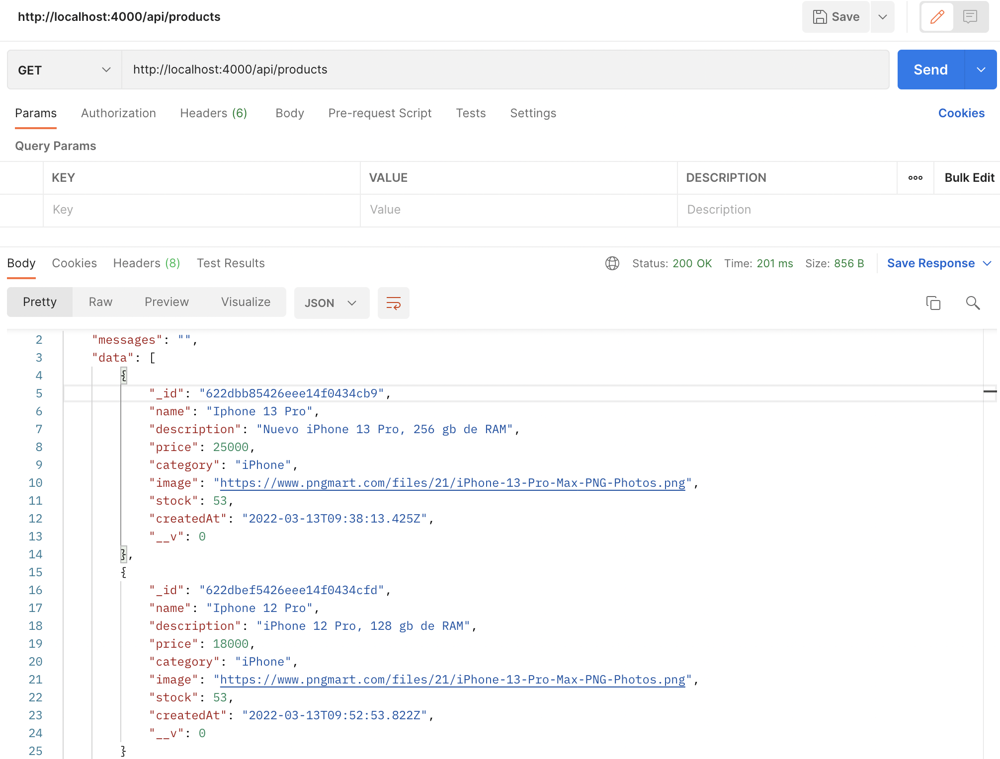

# Proyecto Ecommerce "Apple Store"


Este proyecto está hecho con React JS. Se conecta esta tienda virtual Frontend con Backend. Desarrollado por Kevin Luciano, las imágenes, nombres de productos y precios son de caracter ilustrativo, propiedades de © Apple Inc.

# Dependencias instaladas
* React v17.0.2
* React Router Dom v6.2.2
* Axios v0.26.1
* Nodemon v2.0.15

# Correr el proyecto localmente
## Repositorio Frontend y Backend
### Frontend
```
git clone https://github.com/kalg12/Ecommerce-Apple-Store.git
```
### Backend
```
git clone https://github.com/kalg12/API-Ecommerce-Apple-Store.git
```

## Instale las dependencias de cada proyecto
Desde consola, en el directorio del proyecto, ejecute por cada repositorio clonado sus dependencias con:
```
npm install
```

## Ejecución del proyecto Frontend

En el directorio del proyecto, puede ejecutar:

```
npm start
```

Al ejecutar **`npm start`** abrirá en su navegador la siguiente dirección: [http://localhost:3000](http://localhost:3000)

La página se volverá a cargar cuando realice cambios de manera automática.
También puede ver errores del proyecto en caso de implementar código o correcciones directo en la consola.

## Ejecución del proyecto Backend

En el directorio del proyecto, puede ejecutar:

```
npm start
```

Al ejecutar **`npm start`** se mostrará en consola un mensaje de conexión correcta a la base de datos, de lo contrario, mostrará un mensaje de error con detalles para su solución.

Además se ejecutará una dirección [http://localhost:4000](http://localhost:4000)

Cabe señalar que este se ejecuta en el puerto `4000`

## Consulta del API

Una vez ejecutado el proyecto backend, puede utilizar una aplicación que le permite realizar pruebas API.

### Productos

Para realizar la consulta de productos de la tienda, puede hacerlo con el siguiente enlance:
```
http://localhost:4000/api/products
```

Verá algo similar como la siguiente imagen


**¿Le gustaría saber más sobre el proyecto backend desarrollado? haga clic en el siguiente enlace:**

[https://github.com/kalg12/API-Ecommerce-Apple-Store.git](https://github.com/kalg12/API-Ecommerce-Apple-Store.git)