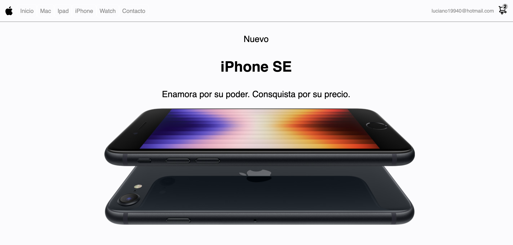

# Proyecto Ecommerce "Apple Store"




Este proyecto está hecho con React JS. Se conecta esta tienda virtual Frontend con Backend. Desarrollado por Kevin Luciano, las imágenes, nombres de productos y precios son de caracter ilustrativo, propiedades de © Apple Inc.

## Dependencias instaladas
* React v17.0.2
* React Router Dom v6.2.2
* Axios v0.26.1
* Nodemon v2.0.15

# Correr el proyecto localmente
## Repositorio Frontend y Backend
### Frontend
```
git clone https://github.com/kalg12/Ecommerce-Apple-Store.git
```
### Backend
```
git clone https://github.com/kalg12/API-Ecommerce-Apple-Store.git
```

## Instale las dependencias de cada proyecto
Desde terminal, en el directorio del proyecto, ejecute:
```
npm install
```

## Ejecución del proyecto

En el directorio del proyecto, puede ejecutar:

```
npm start
```

Al ejecutar **npm start** abrirá en su navegador la siguiente dirección: [http://localhost:3000](http://localhost:3000)

La página se volverá a cargar cuando realice cambios de manera automática.
También puede ver errores del proyecto en caso de implementar código o correcciones directo en la consola.